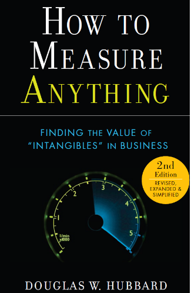
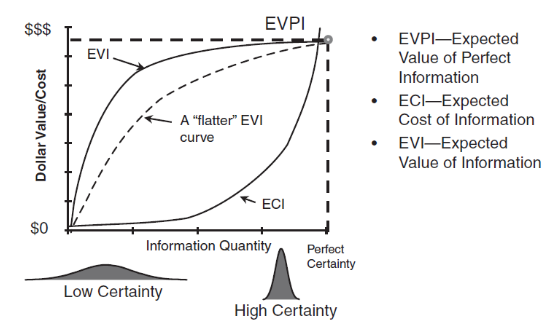

---
output:
  bookdown::pdf_document2:
    latex_engine: xelatex
    fig_caption: yes
    fig_width: 3.5
    fig_height: 2.54
    keep_tex: no
    number_sections: no
    toc: no
    includes:
      in_header: header.tex

documentclass: article
geometry: margin=1in
linestretch: 1
mainfont: Calibri
fontsize: 11pt
linkcolor: RoyalBlue
urlcolor: RoyalBlue
links-as-notes: false
---

```{r, echo=F, warning=F, message=F}
knitr::opts_chunk$set(echo = F,
                      warning = F,
                      message = F,
                      fig.align = "center")
```

# How to Measure Anything by Douglas W. Hubbard - Resenha

Recentemente li o livro ‘How to measure anything’ escrito por Douglas W. Hubbard e neste post vou fazer uma breve resenha dele e explicar por que achei um bom livro para profissionais da área de Analytics e BI.



O livro começa indicando que qualquer coisa que pode ser observada pode ser mensurada, incluindo (i) eficiência de um gestor, (ii) impacto de políticas governamentais, (iii) risco de falências, dentre outras coisas que as vezes assumimos como imensuráveis. Nas primeiras páginas o autor destaca que o objetivo do livro é mostrar que intangíveis que parecem ser não rastreáveis podem ser mensurados e que a mensuração pode ser feita de uma forma que justifique o custo de realizá-la, ou seja, utilizando métodos simples e de baixo custo.

O conceito de mensuração usado pelo autor é de redução de incerteza sobre uma variável. O autor deixa claro que mensurar não é chegar ao valor exato, mas apenas reduzir a incerteza sobre o real valor de uma variável. Esse conceito é bastante relevante para a área de analytics, onde se atua com problemas e decisões com bastante incerteza e os profissionais de dados são colocados no projeto para mensurar uma variável que vai viabilizar esta decisão. É importante ter em mente que não é necessário chegar ao valor exato (salvas excessões como em áreas de controladoria), mas sim em uma estimativa melhor do que a atual sobre a variável. Além desta parte conceitual, o autor mostra 3 exemplos de pessoas que tiveram êxito mensurando variáveis complexas de maneira simples.

Algumas barreiras podem atrapalhar ou até mesmo impedir o sucesso de uma atividade de mensuração. A primeira seria o próprio conceito do que é mensurar, onde algumas pessoas podem não compreender corretamente e pensar que é preciso chegar ao valor mais próximo possível, o que implica em mais tempo de coleta de dados e mais investimento em técnicas ou ferramentas. Outra barreira seria o não entendimento de qual variável deve ser mensurada e a última seria o não entendimento de qual técnica é adequada para se usar. Trazendo estas ideias para a área de analytics, na primeira barreira o profissional de dados deve se atentar para não buscar ter o máximo possível de dados para suportar uma decisão, pois ele deverá aplicar a mensuração com um prazo acordado com seus stakeholders (i.e. pessoas que tomarão a decisão) e este prazo, na maioria das vezes, será curto. Na segunda barreira é preciso ter claro a definição do problema e as variáveis envolvidas para não se ter dúvidas sob quais variáveis devem ser mensuradas, mostrando a importância de se comunicar constantemente com seus stakeholders e estar a par das estratégias e objetivos dos projetos sendo executados. A terceira barreira pode ser mais comum e fazer parte da curva de aprendizado do profissional de dados, onde ele irá aplicar uma técnica de mensuração e depois irá perceber que há outras que podem gerar um resultado melhor, neste caso o importante é estar aberto a sugestões para poder experimentar novas formas de mensurar uma variável. 

Além destas 3 barreiras que atrapalham uma atividade de mensuração, o autor apresenta um outro fator que irá impedir a atividade, que é o benefício esperado da mensuração ser menor do que o valor gasto com a técnica aplicada. Este seria um caso de se fazer uma análise e gerar uma recomendação de decisão porém o problema não ser relevante no momento. Outro cenário seria um problema que irá agregar valor pro negócio porém a mensuração é muito custosa pois a arquitetura de dados não é adequada. Ambos os cenários exigem experiência e conhecimento técnico da área de dados para (i) estar sempre alinhada com a área de negócios para atuar em decisões de alto impacto e (ii) estruturar uma arquitetura de dados que possibilite mensurar variáveis complexas de forma simples e com baixo custo, neste caso seria ter uma modelagem de dados, ferramentas de ETL, datamarts, entre outras features para possibilitar esse benefício.

No capótulo 4 o autor apresenta um framework composto por perguntas que podem ser usadas antes de fazer qualquer mensuração, de forma a não se atrasar por conta das barreiras descritas anteriomente. As perguntas seriam:

* Qual decisão deve ser tomada?
* Quais variáveis estão envolvidas?
* Quão importante a variável é para a decisão?
* Quanto se sabe sobre esta variável atualmente (i.e. nível de incerteza atual)?
* Qual valor será obtido com informação adicional? ou com reducão de incerteza?

Este framework é sem dúvida muito relevante para a área de dados, para que os projetos tenham um propósito bem definido, uma visão de longo prazo e um impacto esperado. 

Outro conceito bastante interessante apresentado no livro que é importante para a área de dados é sobre o valor da informação, ou melhor, o valor que se obtém ao reduzir incerteza. O valor é obtido de maneira indireta, pelas decisões que serão tomadas e o impacto delas em variáveis financeiras, ou pela mudança de comportamento que essa informação gera, ou pela própria venda desta informação. O autor vai além e explica que o valor da mensuração segue a lei dos rendimentos descrescentes (a imagem abaixo mostra o comportamento da curva), desta forma, informação adicional é mais cara e mais difícil de se obter do que a anteriomente gerada, indicando que em situações de muita incerteza e poucos dados, é ideal atuar rapidamente com métodos simples pois o ganho inicial é alto e de baixo custo.



Além destes conceitos, o livro contêm várias explicações sobre métodos estatísticos como simulação monte carlo, amostragem, regressão linear, probabilidade condicional, entre outros. De maneira geral, um excelente livro que os profissionais da área de dados podem extrair bastante conteúdo para aplicar no dia a dia.

